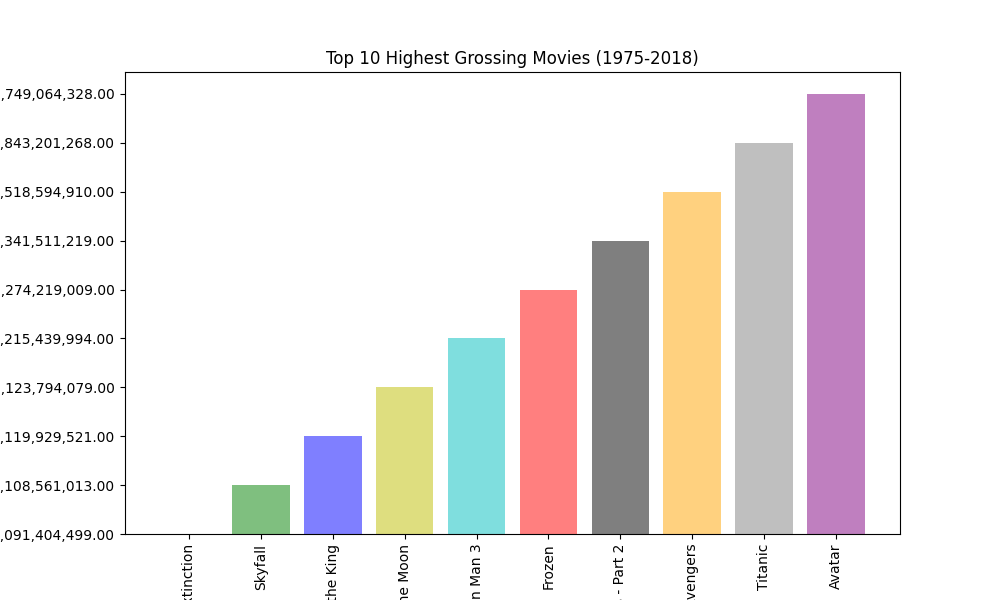
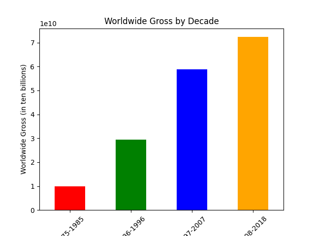
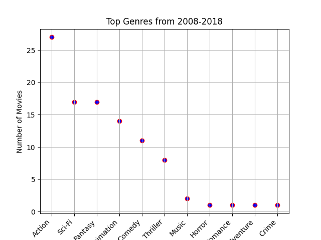
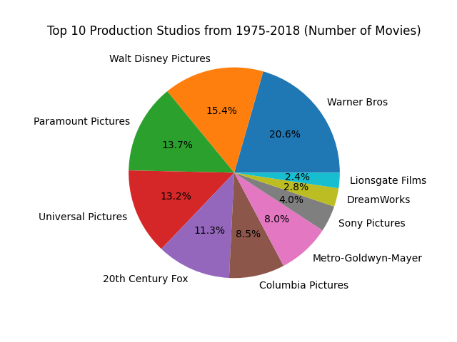
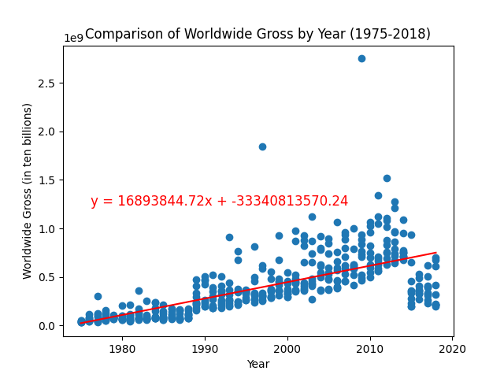
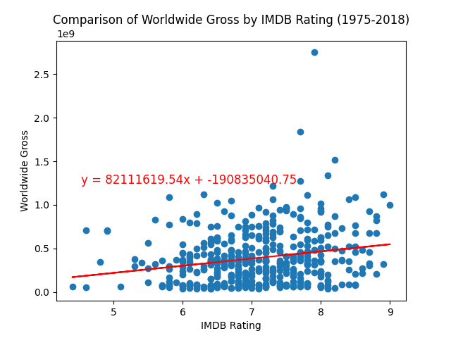

   For this project, we were interested in the worldwide earnings of the top 10 movies from 1975-2018.  More specifically, we looked at the trends between the genre, production studio and earnings of these movies to see what correlations, if any, we could find. First, we read in the CSV file from Kaggle that gave us the list of movies in this time frame. After cleaning up the data, we decided to look only at the 'Main Genre' of each movie as ths would be the most representative of the classification.
    After this, we made a bar chart of the top ten highest grossing movies where we saw James Cameron's 'Avatar' far exceed the list as the number one worldwide earner.
    
    
   Next, we broke the earnings down by decade to find that the highest grossing decade was 2008-2018, not surprising as the top three highest grossing movies were made in this time frame.
    
    
   Additionally, we discovered that 90% of all action movies in this time frame were also made in this decade, thus contributing to the action genre being the most prolific genre of the data set.
   
   Next we examined the percent of movies that were made by each of the production studios. We found that over 70% of the worldwide earnings came from the top 5 companies (Walt Disney, Warner, Paramount, Universal Studios adn 20th Century Fox. Not surprisingly, these production studios represented all of the top ten highest grossing movies as well.
   
    Lastly, we ran two samples for statistical testing. The first was to compare the worldwide gross by year, the second was to compare the worldwide gross by IMDB rating. In the first sample, we found that the trend consistently shows that the earnings have increased as the years have passed. Not surprisingly, this could be attributed to inflation, an increase of expendable income, more diversity in movie choices and many other factors.
    
   In the second sample, we expected a very strong correlation between the worldwide gross and the IMDB user rating. However, we actually found it to be a weak positive correlation. Although the trendline showed an upwards movement, the r value of .21 menas that the relationship was not as strong as we had expected.
   
    To summarize out project, we pulled in an API from OMDb to show the top ten moives, their actors, writers and awards. Unsurprisingly, the top ten movies garnered quite a few awards and nominations across the board. Interestingly, James Cameron led the charts as the writer for the top two highest grossing movies ('Avatar' and 'Titanic') from 1975-2018.